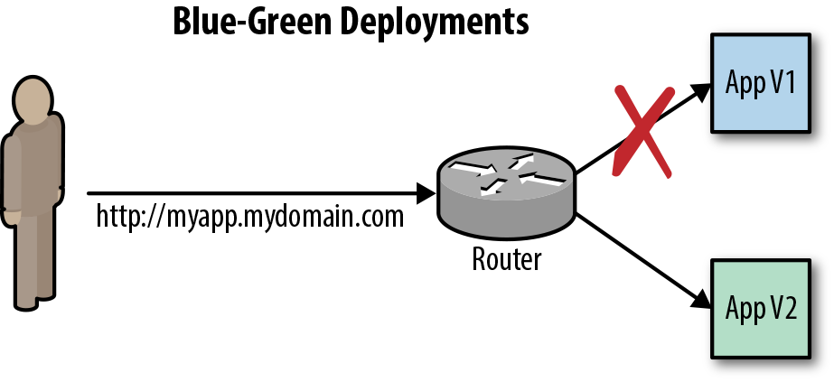

# Gyakorlat 3. - Alkalmazásfejlesztés OpenShift platformon

## Tudnivalók
[Fontos információk](Tudnivalok.md)

**Fontos:**
- OpenShift konvenciók:
  - Felhasználónevetek legyen: studentxy - ahol x y a nevetek kezdőbetűi pl. studentnz (kisbetűk)
  - Projektek nevei: gyakorlatNxy - N a gyakorlat száma,  x, y lsd. előbb, pl. gyakorlat2nz (kisbetűk)
- Mindenki a saját userét használja ezután, hogy izoláltan dolgozzatok!

## Feladat 1. - Deployment Triggerek, Deployment stratégiák
**Időtartam: ~10 perc**

### Célja, leírás

**Deployment Triggerek**
Azok az események, amelyek hatására újratelepítést kell indítani:
1. Config - változik a konfiguráció, pl. a telepítési stratégia, vagy valamilyen monitorozás kerül bele
2. Image  - változik az Image, pl. új verzió buildelődik

**Deployment stratágiák**
Hogyan deployálja ki a platform az alkalmazást.
1. Rolling  - nincs megállás, elindulnak az új konténerek, miközben leskálázódnak a régiek.
2. Recreate - leskálázza a régit 0-ra, és utána indítja az újat  

**Deployment monitorok**
Ennek a feladatnak a célja, hogy kipróbáljátok a _readiness_ és _liveness_ alkalmazás tesztelőket.
Ezek beállításával automatizálható az ellenőrzése az alkalmazásotoknak.
- Readiness probe: Elindult-e az alkalmazás és készen áll-e a működésre?
- Liveness probe : Működik az alkalmazás?


```shell
oc login -u developer -p developer
oc new-project gyakorlat6nz
oc new-app devopswithopenshift/welcome:latest --name myapp
oc expose service myapp

#ezen a ponton érdemes követni OpenShift Console-on az eseményeket, CLI-ben is lehet persze
## felskálázzuk, hogy látványosabb legyen
oc scale --replicas=3 dc myapp

#ellenőrizd a Deployment stratégiát és a Triggerek
oc describe dc myapp
oc set probe dc/myapp --readiness --open-tcp=8080 --initial-delay-seconds=5 --timeout-seconds=5
oc set probe dc/myapp --liveness -- echo ok
#az előbbi lépéseknél szépen lekövethető a Rolling release működése
oc set probe dc myapp --remove --readiness --liveness

#az alkalmazás futásának ellenőrzése
while true; do curl -I http://myapp-gyakorlat6nz.127.0.0.1.nip.io/ 2>/dev/null | head -n 1 | cut -d$' ' -f2;sleep 1;done

#manuális deployment trigger = kézi telepítés
oc rollout latest myapp

# Deployment stratégia váltás
oc patch dc myapp -p '{"spec":{"strategy":{"type":"Recreate"}}}'
```

## Feladat 2. - Blue/Green, A/B, Canary deploymentek
**Időtartam: ~10 perc**

### Célja, leírás
A gyakorlat célja, hogy kipróbáljátok a különböző deployment stratégiákat.

**Blue/Green deployment**

A teljes alkalmazás stack ki van telepítve két példányban és egy paranccsal eldönthető, hogy éppen melyiket érjék el a végfelhasználók
```shell

oc login -u developer -p developer
oc new-project gyakorlat7nz
oc new-app https://github.com/devops-with-openshift/bluegreen#master --name=blue
oc expose service blue --name=bluegreen

oc new-app https://github.com/devops-with-openshift/bluegreen#green --name=green

# route atallitasa
oc patch route/bluegreen -p '{"spec":{"to":{"name":"green"}}}'

```
**A/B deployment**
Több verzió is ki van telepítve és bizonyos százalékban/vagy egyéb feltételek mentén valaki az egyik, valaki a másik verziót látja.
```shell
oc annotate route/ab haproxy.router.openshift.io/balance=roundrobin
oc set route-backends ab cats=100 city=0
```
**Canary deployment**
Több verzió is ki van telepítve és bizonyos feltételek mentén engedjük rá a felhasználókat az új megoldásra. Ehhez már HAProxy template-et kell konfigurálni.


### Jegyzőkönyvhöz
Válaszold meg a témához kapcsolódó kérdést.
